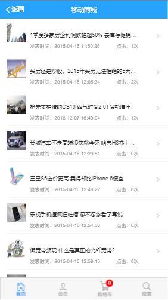
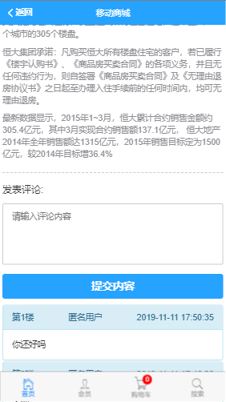
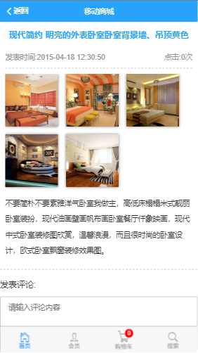
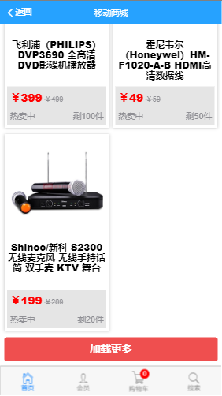
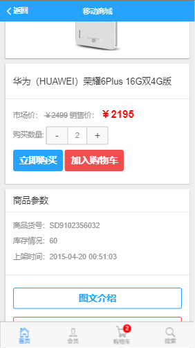
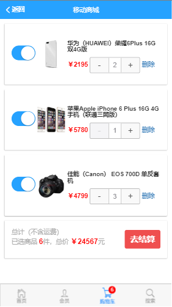

## 移动商城

### 一、app.vue组件的基本设置

1. 头部固定导航栏使用 mint-ui 的`Header`组件；
2. 底部页签使用 mui 的`tabbar`组件;
3. 使用九宫格插件添加菜单导航；

> 页面如下：

### 二、新闻资讯页面制作

1. 绘制界面， 使用 MUI 中的 media-list组件；

2. 使用 vue-resource 获取数据；

3. 渲染真实数据；

> 页面如下：

### 三、新闻详情页面制作

1. 创建新闻详情的组件页面**NewInfo.vue**；

2. 单独封装一个 **comment.vue**评论子组件；

> 页面如下：

###  四、图片分享页面制作

1. 使用mui的`  slider  `组件制作顶部的滑动条；

2. 制作底部的图片列表，需要使用懒加载技术， Mint-UI 提供的现成的组件 `lazy-load` ；

3. 渲染图片列表数据；

> 页面如下：

### 五、图片详情页面制作

1. 使用 插件 vue-preview 插件，制作缩略图；

> 页面如下：

### 六、商品购买页面制作

1. 绘制商品列表页面基本结构并美化；

2. 获取数据渲染页面；

3. 添加加载按钮，渲染**pageindex=2**时的页面，同时要保留之前的页面；

> 页面如下：

### 七、商品详情页制作

1. 使用MUI中的**card**组件，快速创建商品详细页面基本结构并美化；
2. 在Home.vue中抽离轮播图组件，并在商品详细页面引用；
3. 使用MUI中的**numbox**组件，快速创建购买数量模块；
4. 添加图文介绍按钮，采用编程式路由跳转；
5. 添加商品评论按钮，采用编程式路由跳转；
6. 添加小球动画；
> 页面如下：

### 八、结算页面制作

1. 使用vuex,同步更新购物车栏的徽标；

- addShopCart()
- addToCar()
- getAllCount()

2. 绘制购物车页面的商品列表布局；
3. 获取购物车中所有商品列表并加载；

- getGoodsList()

4. 购物车列表初始化数量；

- getInitCount()

5. 购物车商品数量更新同步到store中；

- upDataCount()
- getChangeCount()

6. 购物车商品的删除；

- remove()
- removeShop()

7. 绘制结算区域样式；
8. 把store中选中的状态同步到页面；

- getSelect()

9. 同步商品的勾选状态到store中保存；

- getChangeSel()
- changeSel()

10. 实现勾选数量和总价的自动计算；

- getCountAndPrice()

> 页面如下：

